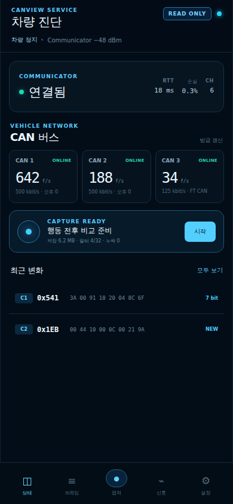
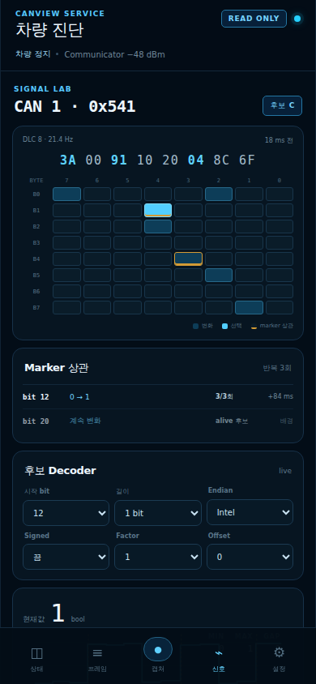

# CAN 신호 검증용 Diagnostic Bridge와 모바일 웹 UI 명세

이 문서는 [아키텍처 개요](README.md)에 속한 read-only 진단 경로의 상세 정본이다. 일반 운전자 UI가 아니라 미확정 CAN signal의 capture·비교·evidence 생성을 다룬다.

## 1. 문서 목적과 구현 상태

이 문서는 2017 Tucson TL에서 아직 확정되지 않은 CAN ID·bit·scale·enum·주기를 PC, 터미널, CAN 분석기 전용 프로그램이나 코드 수정 없이 반복 검증하기 위한 구조를 정의한다. 사용자는 휴대폰 브라우저만으로 연결 상태를 확인하고, 수신 필터를 만들고, 행동 전후 데이터를 비교하고, 후보 signal을 저장하고, 증거 묶음을 내려받을 수 있어야 한다.

이 문서는 **구현 명세**다. 현재 저장소의 ESP-NOW `1.2` header는 payload가 미완성인 draft라서 실행 가능한 protocol이 아니다. 아래 `CAN_OBSERVER_*`, capture, Diagnostic Bridge 역할을 포함한 첫 구현은 `1.3`이며, 그 전에는 어떤 message도 wire로 보내지 않는다. 구현 PR은 machine-readable schema, [`protocol/canview_protocol.h`](../../protocol/canview_protocol.h), codec, static assertion과 golden vector를 같은 변경으로 생성해야 한다.

이 문서의 `MUST`, `MUST NOT`, `SHOULD`, `MAY`는 각각 필수, 금지, 권고, 선택을 뜻한다.

## 2. 결론

기본 구조는 별도 ESP32-S3 보드인 **Diagnostic Bridge**를 추가하는 방식으로 확정한다.

```text
 차량 CAN 1/2/3
       │
       ▼
┌──────────────────── Communicator ────────────────────┐
│ STM32G474: listen-only 수집·timestamp·ID 통계·필터   │
│ ESP32-S3: UART bridge·ESP-NOW peer별 stream scheduler │
└──────────────┬───────────────────────┬───────────────┘
               │ encrypted unicast     │ encrypted unicast
               ▼                       ▼
      ┌─────────────────┐     ┌────────────────────────┐
      │ Controller      │     │ Diagnostic Bridge      │
      │ 운전자 LVGL UI  │     │ ESP-NOW observer       │
      │ 정상 telemetry  │     │ capture·candidate DB   │
      └─────────────────┘     │ SoftAP·HTTP·WebSocket  │
                              └───────────┬────────────┘
                                          │ 2.4 GHz Wi-Fi
                                          ▼
                                  휴대폰 기본 브라우저
```

핵심 결정은 다음과 같다.

- Diagnostic Bridge는 차량 CAN 선에 연결하지 않는다.
- Bridge는 `CONTROL_LEASE`와 차량 `COMMAND_REQUEST` 권한을 절대 받지 않는다.
- Primary Controller는 별도이며, 활성 차량 profile에서 검증된 음량·fader/balance·mute·SPORT 등 기능별 의도 명령과 control lease를 조건부로 사용할 수 있다.
- ESP-NOW broadcast는 discovery 외에 쓰지 않는다. raw CAN과 설정은 peer별 encrypted unicast다.
- Communicator에는 DBC 이름·factor·UI 문구를 넣지 않는다. 한 번 구현한 범용 ID 통계, runtime filter, raw capture만 유지한다.
- signal 후보의 bit 추출·scale 변경은 Bridge와 브라우저에서 처리한다. 새 후보를 볼 때 Communicator firmware를 다시 빌드하지 않는다.
- Controller 내장 웹서버는 하드웨어가 없을 때의 정차 service fallback이다. 정상 운행 중에는 켜지 않는다.
- Wi-Fi AP 접속, filter 변경, capture, 비교, 후보 저장, export를 모두 휴대폰 화면에서 끝낸다.

## 3. 대안 비교

| 방식 | 장점 | 한계 | 판정 |
|---|---|---|---|
| Controller 자체 SoftAP·웹서버 | 추가 보드 없음, LCD에 QR·PIN 표시 쉬움 | LVGL·ESP-NOW·TCP/IP·웹 렌더링이 같은 ESP32-S3 자원을 사용, 장애가 운전자 화면에 영향 | 정차 fallback |
| 별도 ESP-NOW→Wi-Fi Bridge | Controller와 부하·재부팅·저장공간 분리, 1:N 수신 활용, 휴대폰 UI 확장 쉬움 | 보드·전원·pairing 추가, 같은 2.4 GHz channel 제약 | **기본안** |
| Controller TF card에 전구간 저장 | RF 추가 부하가 적고 긴 기록 가능 | 현장에서 비교·필터 수정이 불편, 파일을 꺼낼 도구 필요 | 보조 export |
| USB CDC/WebSerial | packet을 정확히 볼 수 있음 | 휴대폰·브라우저 호환성이 낮고 케이블 필요 | 개발 fallback |
| BLE GATT | 휴대폰 연결 쉬움 | Wi-Fi와 RF 공유, throughput 부족, iOS/브라우저 지원 편차 | 상태·pairing 보조만 |
| 휴대폰 hotspot에 Bridge 연결 | 인터넷과 동시에 사용 가능 | hotspot channel이 바뀌면 ESP-NOW channel도 깨짐 | 금지 |

별도 Bridge가 있어도 한 ESP32-S3 안에서 ESP-NOW와 SoftAP는 같은 radio와 home channel을 공유한다. 따라서 Bridge의 SoftAP channel을 설치 ESP-NOW channel로 고정하고, station interface는 외부 AP에 연결하지 않는다.

## 4. 장치 명칭과 역할

| 정식 명칭 | protocol role | 책임 | 금지 |
|---|---|---|---|
| Controller | `PRIMARY_CONTROLLER` | 운전자 UI, DBC runtime catalog, 허용된 audio·SPORT 의도 명령 | 임의 raw CAN TX, profile 밖 기능 |
| Read-only Controller | `READ_ONLY_CONTROLLER` | 추가 표시 화면 | 모든 차량 명령 |
| Communicator | `COMMUNICATOR` | 세 CAN 수집, raw/stat stream, 최종 TX safety | 표시용 DBC 해석 |
| Diagnostic Bridge | `DIAGNOSTIC_BRIDGE` | 휴대폰 UI, 캡처·후보·증거 저장, observer subscription | control lease, 차량 명령, raw replay |

`Diagnostic Bridge`를 일반 문서에서 `gateway`나 `controller`로 부르지 않는다. 로그 prefix는 `BRIDGE`, firmware 경로는 `firmware/diagnostic-bridge`, 웹 UI 경로는 `ui/diagnostic-web`을 사용한다.

### 4.1 설치 단위 운영 한도

ESP-NOW 자체 상한보다 낮은 다음 운영 한도를 둔다.

| 역할 | 설치당 최대 | 비고 |
|---|---:|---|
| Communicator | 1 | 현재 한 보드가 CAN 3채널 담당 |
| Primary Controller | 1 | control lease 후보는 이 장치뿐 |
| Read-only Controller | 1 | 선택 |
| Diagnostic Bridge | 1 | service session 한 개 |

wire format은 `source_device_id`와 peer session으로 미래의 여러 Communicator를 구분할 수 있게 하되, 첫 구현에서 다중 차량·다중 hop routing을 만들지 않는다. Bridge는 ESP-NOW packet을 다른 ESP-NOW peer로 중계하지 않으므로 loop와 route discovery가 없다.

### 4.2 장치 권한 bit

capability 협상에 다음 permission bit를 추가한다.

| bit | 이름 | Primary Controller | Read-only Controller | Diagnostic Bridge |
|---:|---|---|---|---|
| 0 | `TELEMETRY_READ` | 허용 | 허용 | 허용 |
| 1 | `DIAGNOSTIC_STATS` | service mode | 조건부 | 허용 |
| 2 | `DIAGNOSTIC_CAPTURE` | service mode | 금지 | 허용 |
| 3 | `DIAGNOSTIC_FILTER_WRITE` | secure session | 금지 | 정차 service window |
| 4 | `REMOTE_CONFIG_READ` | 허용 | 조건부 | 허용 |
| 5 | `REMOTE_CONFIG_WRITE` | 설정 owner 정책 | 금지 | 대상·등급별 조건부 |
| 6 | `CONTROL_LEASE` | **조건부 허용** | **금지** | **금지** |
| 7 | `VEHICLE_COMMAND` | **기능 scope별 조건부 허용** | **금지** | **금지** |

이 표의 `VEHICLE_COMMAND`는 포괄적인 raw 송신 권한이 아니다. Primary Controller도 [ESP-NOW 프로토콜의 기능별 control scope](protocols/esp-now.md#33-primary-controller-제어-권한)와 Communicator의 차량 profile allow-list를 모두 통과한 음량 offset, profile 내부 fader/balance·mute, SPORT button pulse 같은 의미 명령만 요청한다.

수신 장치는 role 문자열이 아니라 permission bit, encrypted peer context, service window와 현재 차량 상태를 모두 확인한다. Bridge에서 bit 6 또는 7이 요청되면 protocol 오류가 아니라 명시적인 `PERMISSION_DENIED` application error로 거부하고 보안 counter를 올린다.

### 4.3 1:N·N:M 사용 방식

| 송신 | 수신 | 데이터 | 방식 |
|---|---|---|---|
| Communicator | Controller | 정상 telemetry·bus status | peer별 encrypted unicast |
| Communicator | Diagnostic Bridge | ID stats·제한 raw·capture status | peer별 encrypted unicast |
| Controller | Communicator | 기존 의도 명령·설정 | encrypted unicast + app ACK/result |
| Diagnostic Bridge | Communicator | observer filter·capture·diagnostic lease | encrypted unicast + app ACK/status |
| Diagnostic Bridge | Controller | D2/D3 설정 draft·service 상태 | direct encrypted unicast |
| Controller | Diagnostic Bridge | 설정 승인 결과·AP QR 표시용 상태 | direct encrypted unicast |

한 Communicator가 Controller와 Bridge로 보내는 경로가 1:N이고, 세 장치가 각 소유 기능에 대해 직접 요청·응답하는 형태가 제한된 N:M이다. `esp_now_send(NULL, ...)`로 모든 peer에 같은 payload를 뿌리지 않는다. scheduler가 peer마다 암호화, sequence, filter, quota와 결과 추적을 따로 적용한다.

Bridge는 Controller 설정 요청을 Communicator로 우회 전달하지 않는다. 설정 owner에게 직접 보내므로 중계 loop가 없고, owner가 자신의 schema·revision·안전 조건을 검증한다. discovery를 제외한 broadcast는 상태·raw·설정에 사용하지 않는다.

## 5. Diagnostic Bridge 권장 하드웨어

### 5.1 첫 prototype

| 항목 | 권장값 | 이유 |
|---|---|---|
| MCU module | `ESP32-S3-WROOM-1-N8R2` | 8 MB Flash, 2 MB PSRAM, module 권장 주변온도 -40~85 °C |
| 전원 | USB-C 5 V 개발보드 또는 보호된 5 V 입력 | CAN 배선과 분리, bench·차량 실험 모두 쉬움 |
| 조작 | service/marker 겸용 버튼 1개 | 휴대폰을 보지 않고 event marker 기록 |
| 상태 | RGB LED 1개 | AP, capture, error 상태를 색·점멸로 표현 |
| 저장 | onboard Flash + 선택적 microSD | 짧은 targeted capture는 Flash/PSRAM, 긴 세션은 SD |
| CAN transceiver | 없음 | 차량 bus에 물리적으로 송신할 경로를 만들지 않음 |

`N8R8`은 PSRAM 여유가 크지만 기본 권장 주변온도가 65 °C까지인 variant다. 밀폐된 차량 상시 설치에는 `N8R2`를 우선하고, 더 긴 기록은 PSRAM을 늘리기보다 microSD로 해결한다. 개발실 전용 보드라면 `N8R8`도 사용할 수 있다.

2 MB PSRAM에서는 24 byte internal capture record를 200 record/s로 저장할 때 이론상 약 7분 분량이지만, Wi-Fi buffer와 heap을 함께 써야 한다. 첫 구현은 PSRAM ring을 1 MiB 이하로 제한하고 기본 pre-trigger 5초, post-trigger 15초를 사용한다.

### 5.2 제품화 회로 원칙

- 차량 12 V에 상시 연결한다면 Controller나 Communicator의 보호되지 않은 5 V를 빌려 쓰지 않는다.
- permanent bridge는 역극성·load dump·brownout을 별도 검토하고, service tool은 절연되지 않은 USB와 차량 ground를 동시에 연결하지 않는다.
- button은 short press marker, 2초 long press AP open, 8초 long press pairing request로 구분한다.
- boot strap GPIO, USB D+/D-, PSRAM 점유 GPIO를 button/LED에 사용하지 않는다.
- antenna keep-out과 금속 enclosure 거리를 지킨다. 외장 안테나가 필요하면 `WROOM-1U` variant를 별도 검토한다.

## 6. Radio와 네트워크 정책

### 6.1 고정 channel

Bridge는 `WIFI_MODE_APSTA`를 사용한다.

- STA interface: 외부 AP에 연결하지 않고 ESP-NOW encrypted peer 통신에만 사용한다.
- SoftAP interface: 휴대폰 한 대를 받는다.
- STA와 SoftAP home channel: installation에 저장된 동일 channel.
- country: 설치 국가에 맞는 manual policy. 국내 prototype은 `KR` 설정을 사용한다.
- 운행 중 channel scan과 hopping: 금지.
- phone hotspot 또는 가정 AP 자동 연결: 금지.

ESP-IDF에서 APSTA의 station이 외부 AP에 연결되면 그 AP channel이 우선되어 SoftAP도 이동한다. 이 동작은 Communicator와 ESP-NOW channel mismatch를 만들 수 있으므로 Bridge firmware에는 외부 STA credential 입력 UI 자체를 만들지 않는다.

### 6.2 SoftAP 기본값

| 설정 | 기본값 |
|---|---|
| SSID | `CANView-DIAG-XXXX`, XXXX는 device ID 뒤 4자리 |
| IP | `192.168.4.1` |
| 이름 | `canview-diag.local`, 실패 시 IP 사용 |
| 보안 | WPA2-Personal, 16자 이상 device-unique random password |
| 최대 station | 1 |
| AP open 시간 | 10분, capture active면 최대 30분 |
| client idle timeout | 5분 |
| DNS | captive portal 응답, 외부 DNS forwarding 없음 |
| 인터넷 routing/NAPT | 없음 |

HTTP captive portal은 편의 기능이며 인증 수단이 아니다. vehicle data API는 별도 service session 인증 뒤에만 응답한다.

### 6.3 현장 연결 순서

1. 차량이 정지했고 Bridge LED가 정상인지 확인한다.
2. Bridge button을 2초 누르거나 Controller의 `진단 연결`을 선택한다.
3. Controller가 Bridge에서 받은 SSID·일회 PIN을 QR과 함께 표시한다.
4. Controller가 없으면 enclosure 안쪽의 recovery QR로 AP에 연결하고, 물리 button을 다시 눌러 service window를 승인한다.
5. 휴대폰 captive portal 또는 `192.168.4.1`을 연다.
6. 일회 PIN을 입력한다.
7. 상단에 `읽기 전용 · 차량 정지 · 3 BUS ONLINE`이 확인된 뒤 작업한다.

PIN 5회 실패 시 60초 잠그고, AP password·PIN·session token을 log나 export에 넣지 않는다.

## 7. 안전 경계

### 7.1 반드시 지킬 것

- Bridge에는 raw CAN 송신 API, replay 버튼, arbitration ID+payload 입력 후 전송 기능을 만들지 않는다.
- Browser가 보내는 JSON, WebSocket frame, DBC candidate는 Communicator CAN TX queue로 연결되지 않는다.
- Diagnostic permission과 control permission은 enum·queue·handler를 별도로 둔다.
- 운전 중 휴대폰 조작을 유도하지 않는다. speed가 0보다 크거나 speed freshness가 나쁘면 설정·marker label·filter 편집을 잠근다.
- 이동 중 데이터가 필요하면 정차 상태에서 capture를 arm하고, 주행 중에는 Bridge button marker 또는 자동 trigger만 사용한다.
- diagnostic capture가 포화되면 Bridge raw를 먼저 버린다. Controller 정상 telemetry와 command/ACK를 희생하지 않는다.
- `ESP_NOW_SEND_SUCCESS`를 적용 성공으로 표시하지 않는다. 앱 ACK와 최종 `CAPTURE_STATUS` 또는 `CONFIG_RESULT`가 와야 UI를 확정한다.

### 7.2 설정 등급

| 등급 | 예 | 휴대폰에서 변경 |
|---|---|---|
| D0 Bridge-local | AP timeout, UI refresh, capture retention | service session에서 즉시 |
| D1 진단 stream | observer filter, stats 주기, raw byte budget | 정차+diagnostic lease+응답 확인 |
| D2 Controller-local UX | 밝기, 무조작 복귀, RTC 표시 | Controller online+정차+revision 확인 |
| D3 자동화 | road noise, SPORT threshold/enable | Controller 화면 추가 확인 후 기존 안전 transaction |
| D4 차량·안전 | CAN bitrate, vehicle profile, TX enable, command allow-list | 웹 UI에 노출하지 않음 |

D3는 Bridge가 Communicator에 직접 쓰지 않는다. Bridge가 Controller에 draft를 보내고, Controller가 사용자 확인 후 기존 `CONFIG_SET`과 control policy를 수행한다. Controller가 없거나 확인 timeout이면 변경하지 않는다.

## 8. 무도구 CAN 검증 흐름

### 8.1 한 번의 실험

```text
연결 확인
   │
   ▼
ID 목록 5초 기준선 ──> 행동 template 선택 ──> capture arm
                                               │
                         5초 pre-trigger ring ─┤
                                               ▼
                                      행동/marker 1회
                                               │
                                      15초 post-trigger
                                               ▼
                              변경 ID·byte·bit 자동 순위화
                                               │
                             후보 bit layout을 form으로 조정
                                               │
                           반복 3회 비교·독립 기준값 기록
                                               ▼
                                 후보 저장 또는 제외(X)
```

사용자는 코드를 고치지 않고 다음 작업을 할 수 있어야 한다.

1. 세 bus의 bitrate, online, frame rate, bus error, drop 확인
2. 새로 나타난 ID와 주기적으로 변한 ID 확인
3. ID 하나를 선택해 8 byte와 64 bit 변화 heatmap 확인
4. 전조등, 미등, 문, 4WD LOCK, 오디오, 주행 mode 같은 행동 marker 기록
5. marker 전후에 반복해서 바뀐 bit를 추천 순서로 확인
6. start bit, length, endian, signed, factor, offset을 form으로 바꾸며 live value 확인
7. 후보를 `C/B/A/X` evidence와 함께 저장
8. capture와 manifest를 휴대폰으로 내려받아 GitHub issue나 에이전트에 전달

### 8.2 capture mode

| mode | 목적 | 전송 데이터 | 기본값 |
|---|---|---|---|
| `INVENTORY` | 어떤 ID가 존재하는지 찾기 | ID별 rate·period·change mask·last data | 5초 |
| `EVENT_DIFF` | 행동 전후 변화 찾기 | inventory + 선택된 ID raw pre/post | 5초 전/15초 후 |
| `FILTERED_RAW` | 후보 bit·scale 검증 | 최대 32 filter의 raw frame | 30초 |
| `ARMED_DRIVE` | 속도·가속·4WD 등 주행 실험 | local ring + marker, 휴대폰 UI 잠금 | 최대 10분 |
| `FAULT_SNAPSHOT` | bus-off/drop/reboot 원인 확인 | counters + 전후 5초 raw subset | fault trigger |

전체 세 bus raw mirror는 제공하지 않는다. 먼저 `INVENTORY`로 ID를 좁히고 `FILTERED_RAW`로 내려가는 흐름을 강제한다.

### 8.3 행동 template

| template | 화면 안내 | 권장 반복 | 주의 |
|---|---|---:|---|
| 미등/전조등 | OFF→미등→전조등, 각 단계 marker | 3회 | AUTO 위치와 실제 점등 분리 |
| 문/잠금 | 한 문만 열고 닫기, 잠금은 별도 | 각 문 3회 | door open과 lock feedback 혼동 금지 |
| 4WD LOCK | 정지/저속에서 OEM switch | 3회 | torque로 자동 해석 금지 |
| 가속 페달 | 정차 bench 또는 폐쇄 구간에서 완만히 | 3회 | brake·gear·RPM 함께 기록 |
| 오디오 음량 | 한 step씩 OEM knob 조작 | 5 step | CANView 명령 사용 금지 |
| 주행 mode | OEM button 한 번씩 | mode별 3회 | request와 feedback 분리 |
| 냉간/열간 | 시동 직후와 충분히 열간 | 세션 2개 | 온도 독립 기준 필요 |

template은 marker 이름과 권장 시간만 제공한다. 특정 CAN ID나 bit를 정답으로 미리 고정하지 않는다.

## 9. 범용 관찰 데이터 모델

### 9.1 frame identity

frame의 유일 식별자는 다음 tuple이다.

```text
(source_device_id, communicator_boot_id, bus_id,
 extended_id, arbitration_id, dlc)
```

`source_device_id`는 매 raw record에 반복하지 않고 인증된 ESP-NOW peer/session context에서 붙인다. 11-bit와 29-bit ID가 숫자만 같다고 합치지 않는다. DLC가 세션 중 바뀌면 같은 ID의 variant로 표시하고 protocol counter를 올린다. RTR, error frame, TX echo는 일반 data frame과 분리한다.

### 9.2 ID inventory 필드

| 필드 | 의미 |
|---|---|
| `first_seen_us`, `last_seen_us` | STM32 monotonic 시간 |
| `frame_count` | observation window 수신 수 |
| `rate_tenth_hz` | 0.1 Hz 단위 표시용 rate |
| `period_p50_us`, `period_p95_us` | 주기성 판단 |
| `change_count` | 직전 payload와 달라진 횟수 |
| `bit_change_mask` | window 동안 한 번이라도 바뀐 64 bit |
| `byte_min[8]`, `byte_max[8]` | byte 범위, 선택 상세에서만 전송 |
| `last_data[8]` | 마지막 payload |
| `gap_count`, `dropped_count` | 증거 신뢰도 |

`rate`, `period`, `change_count`는 후보 추천용이지 signal 확정 근거가 아니다. alive counter와 checksum도 많이 변하므로 UI는 반복 행동과의 시간 상관을 별도로 계산한다.

### 9.3 candidate descriptor

| 필드 | 형식 | 필수 |
|---|---|---|
| `candidate_id` | UUID | 예 |
| `name` | UTF-8, 1–48자 | 예 |
| `status` | `CANDIDATE/OBSERVED/VERIFIED/REJECTED` | 예 |
| `bus_id`, `can_id`, `extended`, `dlc` | frame identity | 예 |
| `start_bit`, `bit_length` | 0–63, 1–64 | 예 |
| `byte_order` | `INTEL/MOTOROLA` | 예 |
| `signed` | bool | 예 |
| `factor`, `offset` | finite decimal | 예 |
| `unit` | fixed list + short custom | 예 |
| `valid_min`, `valid_max` | optional finite decimal | 아니오 |
| `invalid_raw[]` | 최대 8개 raw pattern | 아니오 |
| `enum_map[]` | raw→label, 최대 32개 | 아니오 |
| `expected_period_ms`, `stale_ms` | fixed ranges | 예 |
| `source_dbc`, `source_commit` | 문자열/hash | 아니오 |
| `evidence_ids[]` | capture 참조 | 예 |

Browser decoder는 Controller decoder와 같은 Intel/Motorola bit 규칙, sign extension, `physical = raw × factor + offset`을 사용한다. NaN/Infinity, bit 범위 초과, DLC 밖 참조는 저장 전에 거부한다.

### 9.4 evidence와 등급

기존 `C/B/A/X` 등급과 다음 상태를 매핑한다.

| UI 상태 | 문서 등급 | 필요한 증거 |
|---|---|---|
| 후보 | C | DBC 또는 한 번의 변화 관찰 |
| 관찰됨 | B | 같은 차량에서 3회 이상 반복, 방향·bus·ID 확인 |
| 검증됨 | A | 반복 캡처 + 독립 계측/OEM 표시 일치 + unit/scale/range/stale 확정 |
| 제외 | X | 대상 차량에 없거나 반대 증거 기록 |

자동 분석은 `후보` 또는 `관찰됨`까지만 제안할 수 있다. `검증됨` 승격은 UI checklist를 사람이 확인해야 하며 다음 항목이 비어 있으면 저장 버튼을 비활성화한다.

- 독립 기준이 무엇이었는지
- 반복 횟수와 capture ID
- expected range·unit·stale
- ignition/engine/gear/option 조건
- 상반되는 capture가 없는지

### 9.5 event correlation 점수

`EVENT_DIFF`의 추천 순위는 설명 가능한 단순 계산만 사용한다.

1. marker 앞 `[-3 s, -0.5 s]`를 baseline, 뒤 `[+0.2 s, +3 s]`를 action window로 둔다.
2. bit마다 두 window의 1 비율 차이 `delta`를 계산한다.
3. 같은 template 반복에서 방향이 같은 비율을 `repeatability`로 둔다.
4. frame gap이 없는 반복 비율을 `coverage`로 둔다.
5. `score = abs(delta) × repeatability × coverage × 100`으로 정렬한다.
6. alive/checksum 후보는 marker 밖에서도 비슷하게 변하면 `background penalty`를 적용한다.

score가 높아도 자동으로 signal name, endian, factor를 정하지 않는다. UI에는 `marker 뒤 3/3회 0→1`, `평균 지연 84 ms`처럼 근거를 함께 표시한다.

## 10. ESP-NOW protocol 1.3 확장

### 10.1 새 message type

| 값 | 이름 | 방향 | QoS |
|---:|---|---|---|
| `0x28` | `CAN_OBSERVER_CONFIG` | observer→Communicator | Q1 |
| `0x29` | `CAN_ID_STATS` | Communicator→observer | Q0 |
| `0x2A` | `CAN_CAPTURE_CONTROL` | observer→Communicator | Q1 |
| `0x2B` | `CAN_CAPTURE_STATUS` | Communicator→observer | 상태 변화 Q1, 진행 Q0 |
| `0x2C` | `CAN_EVENT_MARKER` | Controller/Bridge→Communicator·Bridge | Q1 |
| `0x2D` | `DIAGNOSTIC_LEASE` | Bridge↔Communicator | Q1 |
| `0x43` | `CONFIG_SCHEMA_REQUEST` | Bridge→설정 owner | Q1 |
| `0x44` | `REMOTE_CONFIG_REQUEST` | Bridge→Controller/owner | Q1 |
| `0x45` | `REMOTE_CONFIG_STATUS` | 설정 owner→Bridge | Q1 |

기존 `CAN_BATCH(0x20)`와 `CAN_FILTER_* (0x23–0x27)`는 그대로 재사용한다. `CAN_FILTER_*` store는 protocol 1.3에서 **수신 peer별 observer filter namespace**를 갖는다. Controller filter revision과 Bridge filter revision을 섞지 않는다.

### 10.2 `CAN_OBSERVER_CONFIG` payload

| offset | 크기 | 필드 |
|---:|---:|---|
| 0 | 8 | `request_token` |
| 8 | 4 | `expected_observer_revision` |
| 12 | 4 | `filter_revision` |
| 16 | 1 | `mode`: OFF/INVENTORY/EVENT_DIFF/FILTERED_RAW/ARMED_DRIVE |
| 17 | 1 | `bus_mask`, bit 0–2만 허용 |
| 18 | 2 | `flags`, unknown bit 거부 |
| 20 | 2 | `stats_period_ms`: 250/500/1000/2000 |
| 22 | 2 | `max_records_per_second`: 1–200 |
| 24 | 4 | `max_bytes_per_second`: 512–20,000 |
| 28 | 4 | `duration_ms`: 1,000–600,000 |
| 32 | 2 | `pretrigger_ms`: 0–10,000 |
| 34 | 2 | `posttrigger_ms`: 0–60,000 |
| 36 | 4 | `reserved=0` |

모든 multi-byte 값은 little-endian이다. `request_token` 중복 제거, config revision optimistic concurrency, app ACK 규칙은 기존 설정 message와 같다. Communicator는 요청값을 조용히 clamp하지 않고 수락값을 `CAN_CAPTURE_STATUS`로 명시하거나 거부한다.

### 10.3 `CAN_ID_STATS` payload

8 byte prefix 뒤 40 byte record를 최대 5개 넣으면 payload 208 byte, 공통 header 포함 240 byte가 된다.

prefix:

| 크기 | 필드 |
|---:|---|
| 4 | `window_end_ms` |
| 1 | `count`, 0–5 |
| 1 | `part_index`, 0부터 |
| 1 | `part_count`, 최소 1 |
| 1 | `reserved=0` |

record:

| 크기 | 필드 |
|---:|---|
| 1 | `bus_id` |
| 1 | `flags_dlc` |
| 2 | `rate_tenth_hz` |
| 4 | `can_id` |
| 4 | `frame_count` |
| 4 | `change_count` |
| 4 | `period_p50_us` |
| 4 | `period_p95_us` |
| 8 | `bit_change_mask` |
| 8 | `last_data` |

part 하나가 없어져도 다음 stats window를 기다리고 재전송하지 않는다. UI는 빠진 part를 `불완전 snapshot`으로 표시하며, 서로 다른 `window_end_ms` part를 합치지 않는다.

### 10.4 capture control과 상태

`CAN_CAPTURE_CONTROL`:

| 크기 | 필드 |
|---:|---|
| 8 | `request_token` |
| 8 | `capture_id` |
| 1 | `action`: ARM/START/STOP/CANCEL |
| 1 | `reserved0=0` |
| 2 | `flags` |
| 4 | `requested_time_ms` |
| 4 | `reserved=0` |

`CAN_CAPTURE_STATUS`:

| 크기 | 필드 |
|---:|---|
| 8 | `request_token` |
| 8 | `capture_id` |
| 1 | `state`: IDLE/ARMED/CAPTURING/FINALIZING/COMPLETE/FAILED/CANCELLED |
| 1 | `reason` |
| 1 | `bus_mask` |
| 1 | `reserved0=0` |
| 4 | `accepted_records` |
| 4 | `dropped_records` |
| 4 | `stored_bytes` |
| 4 | `remaining_ms` |
| 4 | `effective_filter_revision` |
| 4 | `reserved1=0` |

HTTP 202, ESP-NOW MAC success, app ACK, capture completion을 한 상태로 합치지 않는다. Web UI는 `요청 전송`, `장치 수락`, `기록 중`, `저장 완료`를 순서대로 표현한다.

marker는 `CAN_CAPTURE_CONTROL` action으로도 표현하지 않는다. `CAN_EVENT_MARKER` 한 경로만 사용하며 raw text를 싣지 않고 다음 고정 payload를 사용한다.

| 크기 | 필드 |
|---:|---|
| 8 | `capture_id` |
| 4 | `marker_id`, capture 안에서 단조 증가 |
| 4 | `sender_time_ms` |
| 2 | `marker_kind`, 고정 template enum |
| 2 | `flags` |
| 2 | `label_code`, 사용자 label은 Bridge metadata에만 저장 |
| 2 | `reserved=0` |
| 4 | `time_uncertainty_us` |

수신자는 app ACK 뒤 실제 수신 monotonic 시간을 capture metadata에 남긴다. time sync uncertainty가 20 ms를 넘으면 marker를 버리지는 않되 correlation UI에 `시간 오차 큼`을 표시한다.

### 10.5 diagnostic lease

한 번에 한 Bridge만 capture/filter write를 수행한다.

- lease 기본 30초, 10초마다 갱신
- encrypted `DIAGNOSTIC_BRIDGE` peer와 물리 service window 필요
- vehicle speed가 0이 아니면 새 filter write 금지
- `ARMED_DRIVE`는 정차 중 설정을 확정한 뒤 lease를 capture token에 고정하고 주행 중 parameter 변경을 금지
- heartbeat 3회 누락, Bridge reboot, Communicator reboot, session 변경에서 즉시 폐기
- diagnostic lease는 CAN TX 권한을 만들지 않으며 control lease와 다른 type·handler·storage를 사용

`DIAGNOSTIC_LEASE` request/response는 같은 message type과 `RESPONSE` flag를 사용한다. request payload는 `request_token:u64`, `action:u8(ACQUIRE/RENEW/RELEASE)`, `reserved[3]=0`, `requested_ms:u32`, `lease_id:u64`다. 최초 ACQUIRE의 `lease_id`는 0이다.

response payload는 `request_token:u64`, `lease_id:u64`, `status:u8`, `reserved[3]=0`, `granted_ms:u32`, `expires_at_ms:u32`, `owner_device_id:u64` 순서다. 실패 응답에서도 현재 owner와 남은 시간을 제공하되 peer secret이나 MAC 원문은 넣지 않는다.

### 10.6 schema와 remote config

`CONFIG_SCHEMA_REQUEST` payload는 `request_token:u64`, `known_schema_version:u16`, `reserved:u16=0`, `known_digest_prefix:u32`의 16 byte다. digest가 같으면 owner는 `ACK(ACCEPTED)` 뒤 `REMOTE_CONFIG_STATUS`에 `UNCHANGED`를 반환한다. 다르면 기존 bounded bulk protocol로 다음 object를 보낸다.

- object type: `CONFIG_SCHEMA_JSON`
- 최대 크기: 16 KiB
- encoding: UTF-8 canonical JSON, gzip 금지, SHA-256 필수
- 허용 widget: `switch/select/slider/action`
- schema 안의 HTML, CSS, script, URL, expression: 거부

`REMOTE_CONFIG_REQUEST`는 다음 prefix와 기존 8 byte `canview_config_record_t` 배열을 사용한다.

| 크기 | 필드 |
|---:|---|
| 8 | `request_token` |
| 4 | `expected_state_revision` |
| 2 | `schema_version` |
| 1 | `count`, 1–16 |
| 1 | `flags`: `DRAFT`, `CONTROLLER_CONFIRM_REQUIRED` |
| 2 | `ttl_ms`, 500–30,000 |
| 2 | `reserved=0` |
| 8×N | config records |

`REMOTE_CONFIG_STATUS` payload는 `request_token:u64`, `stage:u8`, `applied_count:u8`, `pending_count:u8`, `reserved0:u8=0`, `reason:u16`, `reserved1:u16=0`, `state_revision:u32`, `completed_time_ms:u32`, `detail:u32`의 28 byte다. stage는 `RECEIVED`, `PENDING_CONFIRMATION`, `APPLIED`, `REJECTED`, `EXPIRED`, `UNCHANGED`다. `reason`은 공통 16-bit error code namespace를 사용한다.

D3 요청은 Controller가 먼저 `PENDING_CONFIRMATION`을 보내고 화면에서 사용자가 승인한 뒤 기존 owner transaction을 수행한다. Bridge의 HTTP operation은 최종 `APPLIED` 전까지 완료가 아니다. 같은 token과 digest는 저장된 status를 다시 보내고, 같은 token의 다른 payload는 거부한다.

## 11. Communicator 내부 UART 확장

ESP32와 STM32 사이에는 signal별 코드를 추가하지 않고 다음 범용 message만 한 번 구현한다.

| UART 값 | 이름 | 방향 | 역할 |
|---:|---|---|---|
| `0x14` | `CAN_ID_STATS` | STM→ESP | 모든 수신 ID의 generic 통계 |
| `0x15` | `CAN_OBSERVER_PLAN` | ESP→STM | peer별 요청을 합친 software filter·budget plan |
| `0x16` | `CAN_CAPTURE_CONTROL` | ESP→STM | arm/start/stop/cancel |
| `0x17` | `CAN_CAPTURE_STATUS` | STM→ESP | 실제 적용 revision·drop·상태 |
| `0x18` | `CAN_EVENT_MARKER` | ESP→STM | capture marker와 sender time/uncertainty |

STM32는 FDCAN acceptance를 너무 좁게 바꿔 inventory를 잃지 않는다. bus별 hardware FIFO는 표준/확장 frame을 넓게 받고, 다음 순서로 처리한다.

```text
FDCAN ISR timestamp
  ├─ bus/error counter
  ├─ ID inventory accumulator
  ├─ safety signal path
  └─ observer software filter ──> bounded raw queue ──> UART
```

Communicator ESP32는 Controller와 Bridge의 filter를 union으로 만든 뒤 STM32에 하나의 observer plan을 보낸다. 각 raw record가 ESP32에 도착하면 다시 peer별 filter·quota를 적용해 encrypted unicast한다. 한 peer의 넓은 mask가 다른 peer의 허용 목록을 넓히지 않는다.

peer별 filter는 최대 32개, STM32 union plan은 최대 64개다. 같은 bus/ID/mask/DLC 조건은 하나로 합치고 요청 주기는 가장 빠른 값, raw quota는 peer별 scheduler에서 다시 제한한다. 합친 entry가 64개를 넘으면 기존 active plan을 유지하고 새 요청을 `PLAN_FULL`로 거부한다.

UART `CAN_OBSERVER_PLAN`은 최대 64개를 원자적으로 바꾸기 위해 transaction을 사용한다.

| 필드 | 크기 | 설명 |
|---|---:|---|
| `request_token` | 8 | 전체 plan transaction id |
| `expected_revision` | 4 | 현재 STM plan revision |
| `new_revision` | 4 | commit할 revision |
| `action` | 1 | BEGIN/CHUNK/COMMIT/ABORT |
| `chunk_index` | 1 | 0부터 |
| `chunk_count` | 1 | 최대 2 |
| `entry_count` | 1 | CHUNK당 0–32 |
| `max_bytes_per_second` | 4 | union raw 상한 |
| `max_records_per_second` | 2 | union record 상한 |
| `reserved` | 2 | 0 |
| `entries[]` | 22×N | 기존 `canview_can_filter_t` wire layout |

BEGIN과 COMMIT은 `entry_count=0`이다. CHUNK가 빠지거나 token/revision/chunk_count가 다르면 COMMIT을 거부하고 active plan을 유지한다. staging transaction은 2초 후 자동 폐기한다.

plan revision 적용은 원자적이다.

1. ESP가 새 plan과 expected revision 전송
2. STM이 전체 entry·quota를 임시 buffer에서 검증
3. 모두 유효하면 pointer swap과 revision 증가
4. 적용 revision을 status로 응답
5. 실패하면 기존 plan 유지

## 12. 대역폭과 backpressure

ESP-NOW 기본 PHY rate 1 Mbit/s를 application throughput으로 간주하지 않는다. encrypted unicast를 Controller와 Bridge에 각각 보내면 airtime도 각각 사용한다.

첫 구현 budget은 다음과 같다.

| class | 정상 상한 | 혼잡 시 |
|---|---:|---|
| P0/P1 link·ACK·command reserve | 2 kB/s | 유지 |
| Controller runtime telemetry | 8 kB/s | 동일 signal coalesce, 최소 profile 유지 |
| ID stats | 4 kB/s | period를 1→2초로 낮춤 |
| Bridge filtered raw | 남은 범위, 최대 12 kB/s | 가장 먼저 drop |
| 모든 peer application 합계 | 20 kB/s sustained | admission 거부 |
| 1초 burst | 32 kB | 이후 token bucket 대기/drop |

Bridge UI가 200 raw record/s를 선택해도 전체 budget과 Controller reserve를 넘으면 Communicator가 거부한다. UI는 요청값 대신 `수락 120 frame/s`처럼 effective 값을 표시한다.

queue 우선순위는 기존 ESP-NOW 문서의 P0–P4를 유지한다. stats와 raw capture는 P4다. capture drop이 지속돼도 command ACK나 bus-off event가 지연돼서는 안 된다.

SoftAP HTTP는 같은 radio를 공유하므로 별도 통합 pressure policy를 적용한다. 정차하고 control lease가 없을 때만 upload/download를 최대 64 kB/s로 허용한다. speed가 0이 아니거나 unknown, control lease active, P0/P1 deadline miss 또는 ESP-NOW queue high-water가 발생하면 bulk를 0으로 pause하고 operation cursor로 나중에 재개한다. live system summary는 5 Hz 이하의 작은 응답만 유지한다.

## 13. Bridge firmware 구조

구현 전 protocol payload와 API schema의 선행 작업은 [구현 준비 기준](implementation-readiness.md)과 [T-002](../tasks/T-002-espnow-schema-v1.3.md), [T-402](../tasks/T-402-diagnostic-api-web.md)를 따른다. 이 절의 prose만으로 C payload나 REST response를 임의 정의하지 않는다.

```text
firmware/diagnostic-bridge/
├─ CMakeLists.txt
├─ sdkconfig.defaults
├─ partitions.csv
├─ main/
│  └─ app_main.c
└─ components/
   ├─ canview_transport/   ESP-NOW codec·peer·session·time sync
   ├─ canview_observer/    stats/raw model·filter·diagnostic lease
   ├─ canview_capture/     PSRAM ring·marker·capture state machine
   ├─ canview_candidates/  descriptor·evidence persistence
   ├─ canview_web/         SoftAP·DNS·HTTP·WebSocket·auth
   └─ canview_storage/     NVS·Flash/SD·export

ui/diagnostic-web/
├─ index.html
├─ canview-diagnostics.css
├─ prototype.js
└─ assets/                 local-only, external CDN 금지
```

권장 task와 queue:

```text
Wi-Fi callback -> espnow_rx_queue -> protocol_task -> observer_queue
                                              ├── capture_task -> storage_queue
                                              └── web_model_queue -> websocket_task
HTTP handlers -> api_queue -> observer/config task -> ESP-NOW tx queue
button ISR -> marker_queue -> capture_task
```

Wi-Fi callback, button ISR, HTTP socket callback에서 DBC decode, JSON 생성, Flash write를 하지 않는다. 고정 pool에 복사하고 worker가 처리한다.

### 13.1 partition 기준

8 MB Flash prototype의 출발점은 다음과 같다. 실제 offset은 ESP-IDF 생성 결과로 검증한다.

| partition | 목표 크기 | 내용 |
|---|---:|---|
| NVS + encrypted key | 64 KiB 이상 | peer·AP credential·config |
| OTA app A/B | 각 2 MiB | signed firmware |
| web assets | 1 MiB | gzip HTML/CSS/JS/icons |
| capture metadata | 512 KiB | candidate/evidence index |
| crash/counter | 128 KiB | bounded diagnostic |

긴 raw capture를 internal Flash에 순환 기록하지 않는다. targeted short capture만 저장하고, 긴 `ARMED_DRIVE`는 microSD가 없으면 duration을 제한한다.

## 14. Web server와 인증

### 14.1 transport

- HTML/CSS/JS는 SPI Flash에서 gzip으로 제공한다.
- REST JSON은 snapshot, 설정, capture lifecycle에 사용한다.
- WebSocket은 10 Hz 이하 live summary와 operation 상태에 사용한다.
- raw frame을 JSON 200회/s로 그대로 보내지 않는다. server가 100 ms window로 묶고 visible row만 보낸다.
- capture download는 binary stream이며 HTTP worker를 오래 막지 않는 async path를 사용한다.
- 외부 font, analytics, CDN, internet API를 사용하지 않는다.

### 14.2 인증 흐름

```text
GET /                       공개 splash, 차량 정보 없음
GET /api/v1/bootstrap       challenge·firmware·AP session ID만
POST /api/v1/session        one-time PIN + challenge + client nonce
                            ↓
                     128-bit bearer token
                            ↓
REST Authorization header / WebSocket subprotocol에서 검증
```

token은 HTTP token 문법에 맞는 base64url로 만들고 브라우저 memory에만 둔다. URL, localStorage, log에 넣지 않는다. WebSocket query string에 token을 넣지 않고 `Sec-WebSocket-Protocol`의 일회 session protocol로 전달한다. server는 pre-handshake에서 검증한다.

이 SoftAP는 captive portal 호환 때문에 local HTTP를 사용한다. 따라서 위험한 vehicle command를 웹 기능에서 제거하고, WPA2 password+물리 service window+일회 PIN을 함께 요구한다. 향후 설치 인증서와 신뢰 가능한 local HTTPS UX가 마련되기 전에는 이 경계를 넓히지 않는다.

### 14.3 request 제한

| 항목 | 상한 |
|---|---:|
| 동시 HTTP/WebSocket client | 1 |
| JSON body | 8 KiB |
| candidate import | 256 KiB |
| offline capture import | 16 MiB, SD 필요 |
| URI 길이 | 128 byte |
| header 수 | 필요한 allow-list만 |
| auth 실패 | 5회/분 뒤 60초 lock |
| mutation rate | 5 req/s |
| capture bulk | 정차·control lease 없음 64 kB/s, 그 밖에는 pause |

모든 mutation은 128-bit `request_id`, `expected_revision`, body digest를 가져야 한다. 재전송된 같은 요청은 기존 operation을 반환하고 두 번 적용하지 않는다.

offline import는 저장된 `.cvtrace`를 브라우저 분석 화면에서 다시 여는 기능만 뜻한다. 시간축 재생 결과가 ESP-NOW나 UART/CAN 송신 queue로 전달되는 경로는 만들지 않는다.

## 15. REST API

### 15.1 공통 응답

성공 snapshot:

```json
{
  "schema_version": 1,
  "revision": 42,
  "generated_at_ms": 918223,
  "data": {}
}
```

비동기 mutation:

```json
{
  "operation_id": "01J...",
  "state": "REQUESTED",
  "request_id": "01J...",
  "target": "communicator:7a31"
}
```

오류:

```json
{
  "error": {
    "code": "REVISION_CONFLICT",
    "message": "설정이 다른 화면에서 변경되었습니다.",
    "retryable": true,
    "detail": {"current_revision": 43}
  }
}
```

`message`는 UI용 한글이고 logic은 `code`로 분기한다.

### 15.2 endpoint 목록

| method/path | 용도 | 권한 |
|---|---|---|
| `GET /api/v1/bootstrap` | public challenge, no vehicle data | 공개 |
| `POST /api/v1/session` | service PIN 인증 | 공개+rate limit |
| `DELETE /api/v1/session` | token 폐기·AP 종료 선택 | 인증 |
| `GET /api/v1/system` | Bridge·peer·channel·heap·storage | read |
| `GET /api/v1/peers` | Controller/Communicator 상태·RSSI·RTT | read |
| `GET /api/v1/buses` | 세 bus 상태·bitrate·errors·rate | read |
| `GET /api/v1/frames` | inventory page, filter/sort/cursor | read |
| `GET /api/v1/frames/{bus}/{id}` | byte/bit stats와 recent samples | read |
| `GET /api/v1/filters` | Bridge observer filter snapshot | read |
| `POST /api/v1/filters` | filter 추가 | D1 |
| `PUT /api/v1/filters/{id}` | filter 교체 | D1 |
| `DELETE /api/v1/filters/{id}` | filter 삭제 | D1 |
| `POST /api/v1/captures` | capture arm/start | D1 |
| `POST /api/v1/captures/{id}/markers` | event marker | D1 (`capture:write`), capture active |
| `POST /api/v1/captures/{id}/stop` | 정상 종료 | D1 |
| `GET /api/v1/captures` | 저장 session 목록 | read |
| `GET /api/v1/captures/{id}` | manifest·summary | read |
| `GET /api/v1/captures/{id}/download` | `.cvtrace` export | read |
| `GET /api/v1/candidates` | 후보 목록 | read |
| `POST /api/v1/candidates` | 후보 저장 | D1 |
| `PUT /api/v1/candidates/{id}` | descriptor/evidence 수정 | D1 |
| `POST /api/v1/candidates/{id}/verify` | checklist 기반 등급 변경 | D1 |
| `GET /api/v1/config-targets` | Bridge/Controller/Communicator owner | read |
| `GET /api/v1/config/{target}/schema` | schema-driven widget 정의 | read |
| `GET /api/v1/config/{target}` | 현재값·revision | read |
| `PATCH /api/v1/config/{target}` | allow-listed 설정 변경 | D0–D3 |
| `GET /api/v1/operations/{id}` | end-to-end 적용 상태 | read |
| `GET /api/v1/live` | WebSocket upgrade | 인증 |

`GET /frames` query는 `bus`, exact `can_id`, `changed`, `min_rate`, `sort`, opaque `cursor`, `limit<=100`만 허용한다. SQL이나 자유식 expression을 받지 않는다.

### 15.3 schema-driven 설정

Bridge web asset을 다시 빌드하지 않고 새 설정을 표시할 수 있도록 각 target은 다음 descriptor를 보낸다.

```json
{
  "key": 514,
  "group": "SPORT AUTO",
  "label": "진입 속도",
  "widget": "select",
  "value_type": "u32",
  "options": [
    {"value": 600, "label": "60 km/h"},
    {"value": 700, "label": "70 km/h"},
    {"value": 800, "label": "80 km/h"}
  ],
  "safety_class": "D3",
  "requires_stopped": true,
  "requires_controller_confirm": true
}
```

web renderer가 허용하는 widget은 `switch`, `select`, `slider`, `action` 네 개뿐이다. 임의 HTML, script, CSS, expression을 schema에 넣지 않는다. 숫자 threshold는 target이 보낸 options만 표시하며 자유 text 입력을 만들지 않는다. candidate decoder의 bit/factor처럼 본질적으로 임의값이 필요한 진단 field만 별도 제한 numeric input을 허용한다.

## 16. WebSocket event

모든 event는 `type`, `seq`, `server_time_ms`, `payload`를 가진다.

| type | 최대 주기 | 내용 |
|---|---:|---|
| `system.summary` | 1 Hz | peer, RSSI, heap, storage |
| `bus.summary` | 2 Hz | 3 bus rate/error/drop |
| `frame.inventory` | 5 Hz | 현재 화면에 보이는 ID row delta |
| `frame.samples` | 10 Hz | 선택 ID의 묶인 raw samples |
| `capture.progress` | 5 Hz | state, elapsed, records, drops |
| `operation.changed` | event | ACK/APPLIED/FAILED |
| `candidate.changed` | event | revision 변경 |
| `fault` | event | link, bus-off, storage error |

client는 `subscribe` message로 필요한 topic과 visible ID를 바꾼다. server는 topic별 한 subscriber만 유지하며 화면을 벗어나면 raw sample push를 즉시 중단한다.

## 17. 모바일 UI 정보 구조

기준 viewport는 360–430 px portrait다. Controller의 현대 5W 계열 딥네이비·청색 tone을 유지하되, 운전자 UI가 아니라 정비 화면이므로 정보 밀도와 상태 설명을 높인다.

```text
상단 고정: CANView Service / READ ONLY / 연결·배터리
본문
├─ 상태: peer + CAN1/2/3 + capture 준비
├─ 프레임: ID inventory·검색·정렬·byte 변화
├─ 캡처: template·pre/post·marker·진행·저장
├─ 신호: 64-bit heatmap·decoder·chart·evidence
└─ 설정: Bridge / Controller / 진단 stream
하단 고정: 상태 · 프레임 · 캡처 · 신호 · 설정
```

### 17.1 공통 상단

| 요소 | 표현 | 누르면 |
|---|---|---|
| `READ ONLY` | 항상 cyan outline | 권한 설명 sheet |
| 차량 상태 | `정지`, `주행 중`, `속도 불명` | freshness 상세 |
| 연결 | Communicator RSSI와 packet loss | peer 진단 |
| capture dot | 회색/청색/적색 점 | active capture로 이동 |

`속도 불명`은 정지로 취급하지 않는다. 설정 mutation을 잠그고 이유를 표시한다.

### 17.2 상태 화면

```text
┌─────────────────────────────────┐
│ CANView Service      READ ONLY  │
│ 차량 정지 · Bridge -48 dBm       │
├─────────────────────────────────┤
│ COMMUNICATOR                    │
│ 연결됨  RTT 18 ms  손실 0.3%     │
├─────────┬─────────┬─────────────┤
│ CAN 1   │ CAN 2   │ CAN 3       │
│ ONLINE  │ ONLINE  │ ONLINE      │
│ 642 f/s │ 188 f/s │ 34 f/s      │
│ 500k    │ 500k    │ 125k FT     │
├─────────────────────────────────┤
│ 캡처 준비                        │
│ 저장 6.2 MB · filter 4/32        │
│ [행동 전후 캡처 시작]             │
├─────────────────────────────────┤
│ 최근 변화                        │
│ CAN1 541  21 Hz  3 bit changed  │
│ CAN2 1EB  10 Hz  new            │
└─────────────────────────────────┘
 상태    프레임    캡처    신호    설정
```

bus card는 `ONLINE`, `ERROR PASSIVE`, `BUS OFF`, `UNKNOWN BITRATE`, `NO DATA`를 색과 글자로 함께 표시한다. frame rate가 0이어도 bus가 물리적으로 정상인지 단정하지 않는다.

### 17.3 프레임 화면

상단 filter는 `BUS 전체/CAN1/CAN2/CAN3`, `전체/변화/신규`, 정렬 `ID/빈도/변화/최근`을 select로 제공한다. exact ID 검색만 hex input을 허용한다.

row 구성:

```text
CAN1  0x541   DLC 8       21.4 Hz   18 ms
3A 00 91 10 20 04 8C 6F
·· ▲▲ ·· ▲· ·· ·· ▲·     7/64 bit changed
```

- 바뀐 byte는 cyan, marker와 높은 상관은 amber underline이다.
- row를 누르면 신호 화면으로 이동한다.
- `freeze`는 화면만 멈추며 capture를 멈추지 않는다.
- 오래된 값은 흐리게 하고 age를 남긴다. 0으로 덮지 않는다.
- table 전체를 DOM에 만들지 않고 최대 100 row virtual list를 쓴다.

### 17.4 캡처 화면

1단계 `무엇을 확인합니까?`에서 행동 template을 고른다. 2단계에서 bus, mode, duration, pre/post를 선택한다. 3단계 preflight에서 다음을 모두 보여준다.

- read-only 확인
- 차량 정지 또는 `ARMED_DRIVE` 확인
- 적용될 exact/masked filter 수
- 요청/수락 frame rate와 byte budget
- 예상 저장 크기
- Communicator·Bridge time sync 오차
- 현재 drop과 storage 상태

capture 중 큰 button은 `MARK` 하나만 둔다. marker를 누르면 400 ms 동안 진동 가능한 phone에서 haptic feedback을 주고, 서버가 확정한 marker 번호를 표시한다. `STOP`은 별도 hold 1초 동작으로 오조작을 막는다.

### 17.5 신호 Lab

```text
┌─────────────────────────────────┐
│ CAN1 · 0x541 · DLC 8   후보      │
│ 3A 00 91 10 20 04 8C 6F        │
│ [63...........................0] │
│ □□■■ □□□□  □■■□ ... 64-bit map │
├─────────────────────────────────┤
│ marker 상관                     │
│ bit 12: 0→1, 3/3회, +84 ms      │
│ bit 20: 계속 변화, alive 후보    │
├─────────────────────────────────┤
│ start bit [12]  length [1]      │
│ endian [Intel]  signed [끔]      │
│ factor [1]      offset [0]      │
│ unit [bool]                     │
├─────────────────────────────────┤
│ 값  1          min 0   max 1    │
│ ─────── live chart ───────────  │
├─────────────────────────────────┤
│ 증거 3회 · gap 0 · 독립기준 없음 │
│ [후보 저장] [검증 checklist]     │
└─────────────────────────────────┘
```

64-bit map은 DBC start-bit numbering 혼동을 줄이기 위해 byte 0–7 행과 bit 7–0 열 label을 항상 표시한다. Intel/Motorola를 바꾸면 선택 bit 연결선을 다시 그린다. raw byte는 절대 숨기지 않는다.

factor·offset은 `1`, `0.1`, `0.01`, `0.03125`, `0.5`, `-40` 같은 최근/DBC preset을 먼저 제공하고 `고급`에서만 제한 numeric input을 연다. 입력은 finite, 최대 절댓값, decimal 자리 수를 검증한다.

### 17.6 설정 화면

target selector를 `Bridge`, `Controller`, `Communicator 진단`으로 나눈다. D4 설정은 schema가 와도 숨기는 것이 아니라 `이 설정은 장치에서만 변경`이라고 읽기 전용으로 표시한다.

Bridge 기본 설정:

| 항목 | widget | 값 |
|---|---|---|
| AP 자동 종료 | select | 5/10/20/30분 |
| 화면 갱신 | select | 절약 5 Hz/표준 10 Hz |
| capture 보존 | select | 최근 5/10/20개 |
| privacy export | switch | 기본 사용 |
| AP password 회전 | action | 물리 button 재확인 |

진단 stream:

| 항목 | widget | 값 |
|---|---|---|
| stats 주기 | select | 250/500/1000/2000 ms |
| raw 상한 | select | 20/50/100/150/200 frame/s |
| byte budget | select | 2/4/8/12/20 kB/s |
| pre-trigger | select | 0/2/5/10초 |
| post-trigger | select | 5/10/15/30/60초 |

요청값과 target 수락값이 다르면 같은 row에 `요청 200 · 적용 120 frame/s`를 표시한다. 저장 완료 toast는 end-to-end `APPLIED` 뒤에만 띄운다.

### 17.7 정적 prototype

아래 화면은 실차 데이터가 아닌 UI 구조 검토용 값이다.

| 상태·버스·캡처 준비 | 64-bit Signal Lab |
|---|---|
|  |  |

[`ui/diagnostic-web/index.html`](../../ui/diagnostic-web/index.html)을 브라우저에서 열고 `?screen=status`, `frames`, `capture`, `signals`, `settings` query로 각 화면을 확인한다. 실제 REST·WebSocket 연결 전의 정적 prototype이며, backend 구현이 끝났다고 간주하면 안 된다.

## 18. LED와 물리 button UX

| 상태 | LED |
|---|---|
| boot/pair restore | 흰색 느린 점멸 |
| ESP-NOW online, AP off | 청색 짧은 heartbeat |
| AP open, phone 없음 | cyan 느린 점멸 |
| phone authenticated | cyan 고정 |
| capture armed | amber 느린 점멸 |
| capturing | amber 고정, marker 때 한 번 흰색 |
| storage/link fault | 적색 code 점멸 |
| auth locked | 적색-amber 교대 |

button short press는 capture active일 때만 marker다. capture가 없을 때 short press는 아무 설정도 바꾸지 않는다. 모든 long press는 LED로 인식 결과를 먼저 보여주고 실행한다.

## 19. 저장과 export

### 19.1 capture 내부 record

raw record는 고정 24 byte다.

| 크기 | 필드 |
|---:|---|
| 1 | record type: FRAME/GAP |
| 1 | bus_id |
| 1 | flags_dlc |
| 1 | reserved |
| 8 | STM32 monotonic `time_us` |
| 4 | CAN ID |
| 8 | data |

capture 중 ZIP에 직접 쓰지 않는다. marker와 note는 별도 metadata journal에 기록한다. write는 4 KiB `CVJB` block으로 묶고 각 block에 format version, sequence, used length, CRC-32를 둔다. power loss 뒤 마지막 불완전 block만 버리고 이전 valid block까지 `partial=true`와 GAP/end reason으로 복구한다. `frames.bin`은 8-byte magic `CVFRAME1`, little-endian version/record-size header 뒤에 위 24-byte record를 둔다.

### 19.2 `.cvtrace` 묶음

다운로드 파일은 ZIP store/deflate container이고 최소 다음 파일을 포함한다.

```text
manifest.json
frames.bin
markers.jsonl
inventory.json
candidates.json
diagnostics.json
README.txt
```

`manifest.json` 필수값:

- format version
- capture ID, mode, start/end monotonic and wall time quality
- firmware build hash와 protocol version
- anonymized installation/device ID
- vehicle profile ID, DBC/catalog digest
- bus bitrate/type/listen-only 상태
- applied filter와 budget
- accepted/dropped/gap counter
- marker 목록과 template
- privacy mode

finalize는 frames/metadata digest 검증 뒤 manifest와 ZIP central directory를 마지막에 commit한다. incomplete capture는 partial export만 허용하고 VERIFIED evidence 입력으로 사용할 수 없다.

VIN, peer MAC 원문, SSID, AP password, LMK/PMK, session token, precise GPS는 넣지 않는다. full raw export는 CAN payload 자체에 식별 정보가 있을 수 있다는 경고를 보여주고 사용자가 명시적으로 선택한다.

### 19.3 자동 정리

- complete capture만 retention 대상이다.
- export 중인 capture는 지우지 않는다.
- 공간이 15% 미만이면 오래된 complete capture부터 지우되 candidate evidence가 참조한 capture는 보호한다.
- 공간이 부족해 새 capture를 끝까지 보존할 수 없으면 시작 전에 거부한다.
- NVS에는 raw sample을 반복 기록하지 않는다.

internal Flash preflight는 아래 식을 사용한다.

```text
required = 64 KiB + ceil(rate_limit × 24 × duration_seconds × 1.15)
available = min(capture_partition_free - 256 KiB, 1.5 MiB)
```

`required > available`이면 block 하나도 쓰기 전에 거부한다. microSD가 없는 200 record/s capture는 최대 180초이고, 10분 `ARMED_DRIVE`는 검증된 SD가 있을 때만 선택할 수 있다.

## 20. 오류와 사용자 표시

| 상황 | UI | 동작 |
|---|---|---|
| Communicator heartbeat 누락 | `Communicator 재연결 중` | capture 중단, partial 보존 |
| ESP-NOW channel mismatch | `무선 채널 6 확인` | AP channel 자동 변경 금지 |
| bus no data | `CAN 2 데이터 없음` | offline 단정 전 transceiver 상태 분리 |
| bus-off | 적색 bus card | Bridge는 복구 명령을 보내지 않음 |
| raw budget drop | `데이터 184건 누락` | evidence coverage 감소 |
| stats part loss | `불완전 snapshot` | 다른 window와 합치지 않음 |
| storage full | `저장 공간 부족` | capture 시작 거부 |
| config revision conflict | 최신값 재조회 dialog | 자동 덮어쓰기 금지 |
| target ACK timeout | `적용 확인 안 됨` | 같은 token 제한 재시도 |
| Bridge reboot | phone session 폐기 | 이전 mutation 재실행 금지 |
| speed unknown/moving | lock banner | 모든 D1–D3 편집 금지 |

오류가 끝났다고 기존 candidate evidence grade를 자동으로 올리지 않는다. gap이 포함된 capture는 계속 `coverage 낮음` 표시를 가진다.

## 21. Controller 내장 fallback

별도 Bridge가 없을 때 Controller가 같은 web asset과 API subset을 제공할 수 있다.

조건:

- 차량 정지와 신뢰 가능한 speed 0
- control lease 없음
- 사용자가 Controller에서 `진단 웹 열기`를 선택
- SoftAP와 ESP-NOW를 설치 channel에 고정
- 10분 후 자동 종료
- UI update는 10 Hz 이하, raw capture는 50 record/s 이하
- D0/D1과 Controller-local D2만 제공
- capture active 중 LVGL frame time·heap·ESP-NOW drop을 계속 감시

Controller fallback에서 heap low watermark, UI render deadline miss 또는 ESP-NOW loss가 임계값을 넘으면 웹 연결과 raw capture를 먼저 종료한다. 운전자 화면과 정상 telemetry가 우선이다.

## 22. 구현 순서

### Phase 1: 무선 상태와 inventory

1. `DIAGNOSTIC_BRIDGE` role·permission·pairing
2. 고정 channel APSTA, button, LED, captive portal, session auth
3. peer/bus/counter REST와 상태 화면
4. STM32 ID accumulator와 `CAN_ID_STATS`
5. 프레임 inventory UI

완료 기준: PC 없이 휴대폰에서 3 bus와 ID/rate/change mask를 본다.

### Phase 2: targeted capture

1. peer별 filter namespace와 diagnostic lease
2. software filter union·atomic revision
3. PSRAM pre-trigger ring과 marker
4. capture lifecycle·drop/gap 처리
5. capture UI와 `.cvtrace` export

완료 기준: 미등 OFF/ON 반복 capture를 휴대폰만으로 저장·내려받는다.

### Phase 3: Signal Lab

1. browser generic decoder
2. 64-bit map·chart·event correlation
3. candidate/evidence CRUD와 C/B/A/X checklist
4. capture 재열기와 비교

완료 기준: start bit·factor 변경에 Communicator rebuild가 필요 없다.

### Phase 4: schema-driven remote settings

1. target config schema·revision
2. D0–D3 권한과 Controller confirmation
3. operation end-to-end status
4. duplicate/reboot/conflict recovery

완료 기준: 적용 확인 없는 optimistic success가 0건이다.

## 23. 시험과 완료 조건

### 23.1 무도구 사용자 시험

- [ ] 새 휴대폰에서 앱 설치 없이 AP 연결→dashboard까지 60초 이내
- [ ] PC, serial monitor, devtools 없이 filter add/change/delete 가능
- [ ] 세 bus 상태와 bus별 drop/error를 구분해 표시
- [ ] 행동 template→marker 3회→변경 bit 추천→후보 저장 가능
- [ ] 저장 capture를 휴대폰 share/download로 export 가능
- [ ] 실제 적용되지 않은 설정이 성공으로 표시되는 경우 0건

### 23.2 protocol·fault 시험

- [ ] ESP-NOW 1%, 5%, 20% loss에서 stats/capture 상태 일관성
- [ ] duplicate config/capture token이 한 번만 적용
- [ ] Controller, Bridge, Communicator 각각 reboot 시 이전 lease·mutation 폐기
- [ ] channel mismatch에서 자동 hotspot 연결이나 hopping 없음
- [ ] malformed stats part, length, reserved, CRC, revision 거부
- [ ] Bridge가 `CONTROL_LEASE`/vehicle command를 보내면 항상 거부
- [ ] 두 observer 요청 union 뒤에도 peer별 allow-list 독립

### 23.3 성능 시험

- [ ] Controller 정상 telemetry 20 Hz 유지 중 Bridge stats 1 Hz
- [ ] Bridge raw 12 kB/s 포화에서 P0/P1 drop 0
- [ ] visible 100 frame row와 10 Hz chart에서 phone scroll hitch 없음
- [ ] 30분 capture에서 Bridge watchdog/reset/heap leak 없음
- [ ] 8시간 AP open/close·WebSocket reconnect soak test
- [ ] Flash power cut 뒤 complete block과 candidate DB 복구

### 23.4 Browser 시험

- [ ] Android 최신 Chrome portrait/landscape
- [ ] iOS 최신 Safari captive portal과 일반 Safari
- [ ] captive mini-browser가 download를 막으면 `Safari/Chrome에서 열기` 안내
- [ ] 외부 인터넷이 없어도 모든 icon/font/chart 동작
- [ ] 360×640에서도 주요 action과 상태가 가려지지 않음

## 24. 구현 시 금지사항

1. Bridge에서 raw CAN replay 또는 임의 TX endpoint 추가
2. ESP-NOW broadcast에 raw CAN·VIN·credential 포함
3. `ESP_NOW_SEND_SUCCESS`만 보고 설정 완료 처리
4. external AP/hotspot 연결로 ESP-NOW channel을 따라가게 만들기
5. 모든 CAN frame을 JSON WebSocket으로 무제한 push
6. 서로 다른 stats window part를 합쳐 정상 snapshot처럼 표시
7. candidate score만으로 `VERIFIED/A` 자동 승격
8. setting schema에 HTML/script/expression 허용
9. browser token을 URL/localStorage/export에 저장
10. Bridge failure가 Controller queue나 차량 control lease에 영향

## 25. 공식 근거

- [ESP-IDF 5.5.2 ESP-NOW](https://docs.espressif.com/projects/esp-idf/en/v5.5.2/esp32s3/api-reference/network/esp_now.html): v1/v2 payload, CCMP, PMK/LMK, peer와 channel, MAC callback와 app ACK 제약
- [ESP-IDF 5.5.2 Wi-Fi driver](https://docs.espressif.com/projects/esp-idf/en/v5.5.2/esp32s3/api-guides/wifi.html): APSTA와 station home channel 우선순위
- [Espressif ESP-NOW FAQ](https://docs.espressif.com/projects/esp-faq/en/latest/application-solution/esp-now.html): Wi-Fi 동시 사용 시 동일 channel, 실제 throughput과 peer 수 주의
- [ESP-IDF 5.5.2 HTTP server](https://docs.espressif.com/projects/esp-idf/en/v5.5.2/esp32s3/api-reference/protocols/esp_http_server.html): WebSocket, pre-handshake 인증, REST, file serving, captive portal
- [ESP-IDF captive portal example](https://github.com/espressif/esp-idf/tree/v5.5.2/examples/protocols/http_server/captive_portal)
- [ESP-IDF RESTful server example](https://github.com/espressif/esp-idf/tree/v5.5.2/examples/protocols/http_server/restful_server)
- [ESP32-S3-WROOM-1/1U datasheet](https://www.espressif.com/sites/default/files/documentation/esp32-s3-wroom-1_wroom-1u_datasheet_en.pdf): Flash·PSRAM·온도 variant
- [ESP-IDF 5.5 security enablement](https://docs.espressif.com/projects/esp-idf/en/v5.5/esp32s3/security/security-features-enablement-workflows.html): Secure Boot, Flash/NVS encryption 생산 적용

## 26. 관련 문서

- [시스템 아키텍처와 명명](system.md)
- [ESP-NOW 양방향 프로토콜](protocols/esp-now.md)
- [Communicator 내부 UART](protocols/communicator-uart.md)
- [Controller CAN filter·DBC pipeline](controller-can-pipeline.md)
- [2017 Tucson TL CAN 후보](../vehicle/signal-catalog.md)
- [장치별 개발환경](../development/toolchains.md)
- [운전자 LVGL UI](../ui/design.md)
