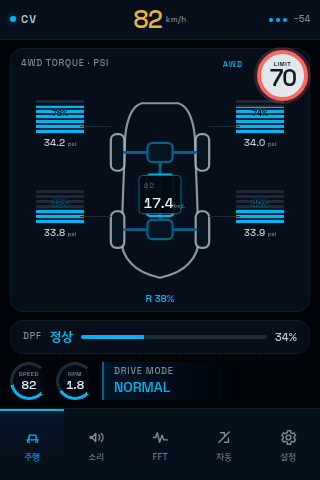
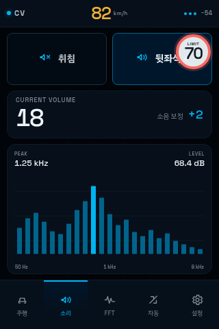
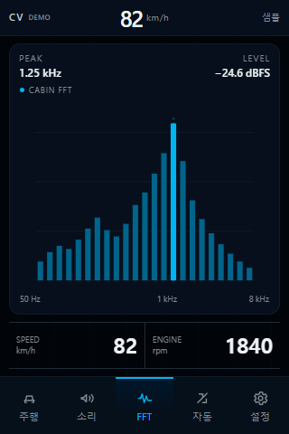
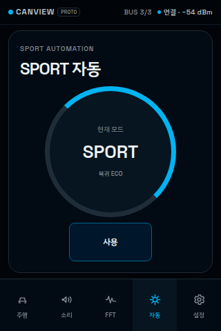
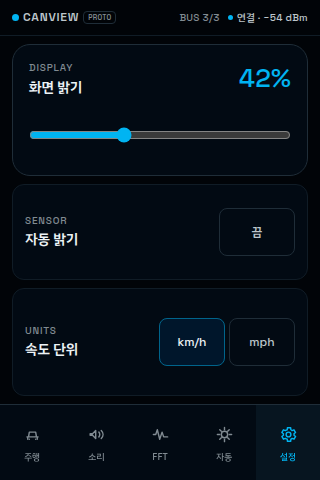
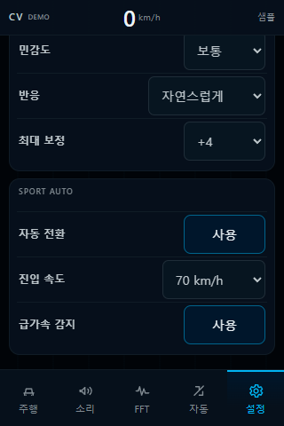

# CANView 운전자 UI 설계

## 1. 목표와 기준

CANView는 순정 계기판을 대체하지 않는 320×480 세로형 보조 화면이다. 운전자가 짧은 시선으로 차량 상태를 확인하고, 정차 중에만 자동화 세부값을 조정하도록 설계한다.

- 화면 언어는 현대 표준형 5W 내비게이션의 검정·딥네이비 바탕, 청색 활성선, 흰색 수치, 낮은 채도의 보조 텍스트를 따른다.
- 시각 밀도와 상호작용은 LVGL 공식 데모를 기능 단위로 비교해 채택한다. 특히 `ebike`의 큰 핵심 수치, 얕은 계층, 설정 구성과 `music`의 세로형 미디어 레이아웃을 적극 사용한다.
- 4WD는 현대 순정 AWD 정보 화면처럼 중앙 차량과 네 바퀴 주변의 구동 막대를 한 덩어리로 읽게 한다.
- DBC 후보명, raw 값, 판단 경로와 통신 진단은 일반 화면에서 숨긴다. 현장 분석은 별도 [Diagnostic Bridge 모바일 웹 UI](can-diagnostics-web.md)에서 수행한다. 값이 검증되지 않았거나 stale이면 숫자를 꾸며내지 않고 `—` 또는 중립 상태로 바꾼다.
- 화면 속도 단위는 `km/h`로 고정한다.

참고 원문은 [LVGL 현재 공식 데모](https://github.com/lvgl/lv_demos/tree/master/src), [LVGL 8.4 공식 데모](https://github.com/lvgl/lvgl/tree/v8.4.0/demos), [LVGL eBike](https://github.com/lvgl/lv_demos/tree/master/src/ebike), [현대 표준형 5W 업데이트 가이드](https://update.hyundai.com/KR/KO/updateGuide/lR1ECJ?pfm=std_5w), [현대 AWD 표시 설명](https://ownersmanual.hyundai.com/full_webhelp/NE1N/2025/en_UK/id2362EL00RUI.html), [Tucson 순정 AWD 화면이 실린 설명서 mirror](https://manuals.plus/m/e70406c0d290b3a4e1cc1088e5256e2b3312df5fbd2e1c80583eb9203b77e45f_optim.pdf)다. 최신·타시장 AWD 설명의 차량별 계산식이나 색상을 2017 Tucson에 적용한다는 뜻은 아니며, 중앙 차량과 바퀴별 분배 표시라는 시각 문법만 차용한다.

## 2. LVGL 공식 데모 전체 검토

프로젝트 런타임은 LVGL 8.4 API를 기준으로 한다. 현재 별도 `lv_demos` 저장소의 7개 데모는 설계 참고 자료이고, LVGL 8.4에 포함된 5개 데모는 위젯 동작·성능 검증의 기준이다. 공식 데모 소스를 제품 펌웨어에 통째로 링크하지 않는다.

### 2.1 현재 `lv_demos` 7종

| 데모 | 판정 | CANView 적용 |
|---|---|---|
| `ebike` | 적극 채용 | 큰 주행 수치, 상태 중심 첫 화면, 카드보다 명확한 구획, 짧은 하단 탐색, slider·dropdown 중심 설정 구조 |
| `flex_layout` | 채용 | 화면 폭을 고정 좌표로 채우기보다 flex grow와 gap으로 배분하고, 같은 행 수치의 정렬을 유지 |
| `high_res` | 부분 채용 | 크기·간격 token을 한곳에서 관리하는 방식만 채택. 320×480에서 고해상도 자산과 넓은 여백은 제외 |
| `multilang` | 준비만 채용 | 한글 문자열과 숫자 폰트를 분리하고 사용 글리프만 변환. 런타임 언어 전환 UI는 현재 범위에서 제외 |
| `scroll` | 채용 | 설정 본문만 세로 scroll, 하단 탐색은 고정. scroll momentum은 사용하되 중요한 값이 관성으로 바뀌지 않게 함 |
| `smartwatch` | 부분 채용 | 작은 화면의 한 화면 한 목적, 짧은 상태 표기만 채택. 원형 화면·과도한 제스처 의존은 제외 |
| `transform` | 시험용 | 화면 전환 성능 시험에만 사용. 주행 수치에는 회전·확대 변형을 적용하지 않아 픽셀 흔들림과 GPU 부담을 피함 |

### 2.2 LVGL 8.4 기본 데모 5종

| 데모 | 판정 | CANView 적용 |
|---|---|---|
| `widgets` | 적극 채용 | `lv_arc`, `lv_bar`, `lv_chart`, `lv_slider`, `lv_switch`, `lv_dropdown`의 상태·비활성·focus 동작 기준 |
| `music` | 적극 채용 | 272×480 세로형 정보 위계, 큰 현재값과 spectrum의 결합, 화면 교체 fade와 재생 상태의 절제된 강조 |
| `keypad_encoder` | 미래 호환 | touch가 주 입력이지만 향후 rotary/steering 입력을 붙일 때 group/focus 이동 기준으로 사용. 현재 text input은 만들지 않음 |
| `benchmark` | 검증용 | 실제 보드에서 FPS, render time, flush time을 비교해 shadow·opacity·chart point 수를 결정 |
| `stress` | 검증용 | 탭 반복, 설정 scroll, FFT 갱신, animation 취소/재시작의 장시간 heap 누수와 객체 수명 시험 |

`examples` 모음은 단일 API 사용 예제이므로 화면 벤치마크 목록에는 섞지 않는다. 필요한 위젯 구현을 확인할 때만 해당 API 예제를 추가로 대조한다.

## 3. 정보 구조

```text
상단 36 px: CANView 상태 / 현재 속도 / 무선 상태
본문 368 px
├─ 주행: 대형 4WD·TPMS·중앙 순간연비 → DPF → 작은 속도·RPM 원형 계기
├─ 소리: 취침·뒷좌석+ → 현재 음량 → Cabin FFT
├─ FFT: Peak·Level을 그래프 내부에 둔 대형 spectrum
├─ 자동: SPORT 자동화와 현재 주행 mode
└─ 설정: 화면 → 주행 소음 보정 → SPORT 자동화
하단 72 px: 주행 / 소리 / FFT / 자동 / 설정
전역 overlay: 제한속도 표지와 과속 경고
```

기본 화면은 `주행`이다. 설정한 무조작 시간이 지나면 어느 화면에서든 밝기를 낮추고 주행 화면으로 돌아간다. 터치하면 원래 밝기로 복귀한다.

### 3.1 주행 화면

화면 면적은 4WD가 압도적으로 크고 DPF, 속도·RPM 순으로 작아진다. 352 px의 실제 본문 높이 중 264 px를 4WD에 할당해 차량과 구동계가 약 75%를 차지하게 한다.

- 4WD: 첨부한 순정 화면처럼 중앙 차량 outline 안에 앞·뒤 differential와 propeller shaft를 그리고, 네 바퀴 바깥쪽에 8단 수평 분절 torque bar를 대칭 배치한다. 각 bar 아래에는 해당 바퀴 공기압 `psi`를 둔다. [2017 Tucson TL 취급설명서 제원](https://www.hyundaicanada.com/-/media/hyundai/feature/ownerssection/manuals/english/2017/tuscon/tl-can-eng-8.pdf)의 전장 4,475 mm, 전폭 1,850 mm, 축거 2,670 mm, 전·후 윤거 1,608/1,620 mm를 기준으로 화면 좌표의 타이어 외곽 `100×242`, 축간 `144`, 좌우 휠 중심 간격 `86`으로 다시 맞췄다. 후면은 실제 리프트게이트 SUV처럼 평평한 끝단과 짧은 범퍼 모서리로 표현한다. 공개 DBC만으로 실제 바퀴 토크가 확정되지 않았으므로 데이터 모델에서는 계속 `구동 지수`로 관리한다.
- 연비: `순간 연비`만 차량 중앙 coupling 위치의 작은 정보 창에 표시한다. 신호가 없으면 `—`로 유지한다. 평균연비는 주행 화면에 표시하지 않는다.
- DPF: 정상일 때는 작은 청색 상태와 부하값만 표시하고, 경고가 확인될 때만 amber/red 상태로 바꾼다. DBC에는 경고등 후보만 있으므로 현재 부하율은 별도 진단 신호가 검증되기 전 데모값이다.
- 속도·RPM: 같은 원형 arc 문법을 쓰되 화면 하단의 보조 계기로 축소한다. 현재 속도는 상단에도 항상 남는다.

### 3.2 소리와 FFT

`취침`과 `뒷좌석 +`는 검증된 profile 명령이다. 임의 sound-position UI와 음량 ± 버튼은 두지 않고 현재 OEM 음량만 크게 표시한다. 하단 `CABIN FFT`에는 주파수 막대, 그래프 안 왼쪽 위 `PEAK`, 오른쪽 위 `LEVEL`을 둔다.

FFT 전용 화면은 본문 대부분을 50 Hz–8 kHz spectrum에 할당한다. 23개 log-frequency bin을 사용하며 dB는 마이크·ADC·window·reference calibration 전에는 상대 레벨이다. 속도와 RPM은 별도 계기를 반복하지 않고 상단의 지속 속도와 CAN telemetry에서 연관 분석한다.

### 3.3 SPORT 자동화

원형 mode 장식 없이 `SPORT`, `NORMAL`, `ECO` 문자열 자체를 큰 상태 필드로 쓴다. SPORT는 적색, NORMAL은 청색, ECO는 녹색이다. 자동화는 SPORT 진입 전 `previous_mode`를 저장하고 해제 조건에서 그 mode로 돌아간다. 판단 경로·가속 후보 문구는 표시하지 않는다.

### 3.4 설정

사용자가 연속값을 다루는 밝기는 slider, 켜고 끄는 기능은 switch/button, 안전하게 제한해야 하는 숫자는 dropdown을 사용한다. 자유 숫자 text input은 없다.

| 그룹 | 위젯 | 값 |
|---|---|---|
| DISPLAY | 밝기 slider | 10–100% |
| DISPLAY | CAN 자동 밝기 switch | 끔/사용 |
| DISPLAY | 무조작 복귀 dropdown | 15/30/60/120초, 기본 30초 |
| ROAD NOISE | 사용 switch | 끔/사용 |
| ROAD NOISE | 대역 dropdown | 노면 125–500 Hz / 표준 160–1,250 Hz / 풍절 500–2,000 Hz |
| ROAD NOISE | 민감도 dropdown | 낮음/보통/높음 |
| ROAD NOISE | 반응 dropdown | 느리게/자연스럽게/빠르게 |
| ROAD NOISE | 최대 보정 dropdown | +2/+3/+4 step |
| SPORT AUTO | 사용 switch | 끔/사용 |
| SPORT AUTO | 진입 속도 dropdown | 60/70/80 km/h |
| SPORT AUTO | 급가속 감지 switch | 끔/사용 |

## 4. 제한속도·야간·유휴 상태

제한속도 표지는 모든 화면의 오른쪽 위에 뜬다. 설정·오디오처럼 touch 요소가 있는 화면에서는 opacity를 낮추며, LVGL에서 `LV_OBJ_FLAG_CLICKABLE`을 제거하고 Web prototype에서 `pointer-events: none`으로 처리해 아래 control을 계속 누를 수 있다.

- 표시 시작: 내비게이션 속도 제한값과 valid/source flag가 함께 유효할 때
- 경고 진입: 현재 속도가 제한속도의 110% 이상으로 500 ms 유지
- 경고 해제: 105% 아래로 1초 유지
- 경고 표현: 400 ms 간격의 stepped blink와 최소 90% 임시 밝기
- 경고 종료: 사용자가 이미 유휴 상태였다면 유휴 밝기로 복귀

미등 실제 활성 신호를 500 ms 확인하면 야간 mode로, 소등을 1.5초 확인하면 주간 mode로 전환한다. switch의 `AUTO` 위치만으로 야간을 판정하지 않는다. 밝기는 240 ms 이상의 보간으로 목표를 따라가며, 유휴·과속 우선순위와 상세값은 [자동 제어 로직](automation-control.md)에 둔다.

## 5. 시각·동작 token

정본은 [`tokens.css`](../tokens.css), LVGL 색상은 [`canview_theme.h`](../ui/lvgl/canview_theme.h)다.

| 역할 | 표현 |
|---|---|
| 바탕 | 거의 검은 청색 `#020b13` 계열 |
| 표면 | 딥네이비, 1 px 청회색 경계, 장식 shadow 최소화 |
| 활성·NORMAL | 현대 5W 계열 cyan/blue |
| SPORT | 적색, mode와 실제 경고에만 사용 |
| ECO | 녹색, mode 표시에만 사용 |
| 수치 | 흰색 tabular figure, 단위는 작고 낮은 채도 |
| 경고 | amber 또는 red와 label을 함께 사용해 색에만 의존하지 않음 |

화면 전환은 160 ms fade, arc·bar는 180–300 ms ease-out, 밝기는 최소 240 ms ramp를 쓴다. 새 telemetry가 들어오면 진행 중 animation의 현재값에서 새 목표로 이어서 보간해 점프하지 않는다. 경고 blink만 의미를 분명히 하기 위해 연속 fade가 아닌 단계 전환으로 둔다.

## 6. Web·LVGL 매핑

| 구성요소 | Web prototype | LVGL 8.4 |
|---|---|---|
| 지속 속도 | 상단 text | `lv_label` |
| 제한속도 overlay | 비클릭 absolute layer | foreground `lv_obj` + `lv_label`, click flag 제거 |
| 속도/RPM | SVG arc | `lv_arc` + `lv_label` |
| 4WD·TPMS | SVG driveline + 8단 CSS segment | `lv_line` + `lv_obj` differential/wheel/segment + labels |
| 연비·DPF | semantic rows | `lv_obj`, `lv_label`, `lv_bar` |
| audio profile | button | checkable `lv_btn` |
| FFT | SVG bars | `lv_chart` bar series |
| 설정 | range/button/select | `lv_slider`, `lv_btn`, `lv_dropdown` |
| 하단 탐색 | fixed buttons | five `lv_btn` |

[`canview_ui.c`](../ui/lvgl/canview_ui.c)는 `canview_ui_model_t`만 입력받고 `CANVIEW_UI_CMD_*` 의미 명령만 callback으로 내보낸다. Primary Controller는 취침·뒷좌석 강화·주행 소음 보정에 필요한 volume, profile 내부 fader/balance와 mute 명령을 요청할 수 있지만, raw CAN frame 생성과 최종 제어 허용 판단은 UI 밖에 둔다. 임의 sound-position 조정 화면과 volume ± 버튼을 숨긴 현재 UI 방침은 유지한다.

## 7. 화면 prototype

아래 이미지는 실차 측정값이 아닌 레이아웃 검토용 데모 데이터다.

| 주행 상태 | 소리 | FFT |
|---|---|---|
|  |  |  |

| SPORT 자동화 | 설정 | 설정 하단 |
|---|---|---|
|  |  |  |

[`ui/prototype/index.html`](../ui/prototype/index.html)을 다음 query로 열 수 있다.

```text
index.html?screen=drive
index.html?screen=audio
index.html?screen=fft
index.html?screen=automation
index.html?screen=settings
index.html?screen=settings&scroll=bottom
```

## 8. 실제 보드 검증 기준

- 320×480에서 수평 scroll, 잘림, font baseline 이탈이 없어야 한다.
- 설정만 세로 scroll되고 header·하단 탐색·제한속도 overlay는 고정되어야 한다.
- 제한속도 overlay 아래의 touch control이 warning 중에도 동작해야 한다.
- 4WD와 TPMS의 freshness가 독립적으로 표현되고 `0`과 unavailable이 구분되어야 한다.
- 새 FFT frame이 들어올 때 chart가 떨리거나 heap이 증가하지 않아야 한다.
- 20 Hz telemetry와 동시 animation에서 목표 FPS와 flush budget을 `benchmark` 방식으로 측정한다.
- 탭·scroll·animation 취소를 반복하는 8시간 soak test를 `stress` 방식으로 수행한다.
- 야간 최소 밝기, 유휴 복귀, 과속 강제 밝기, 과속 종료 후 유휴 복귀를 실물 PWM에서 확인한다.
- SPORT 실제 송신은 수신 전용 검증과 별도 release gate를 통과할 때까지 활성화하지 않는다.
